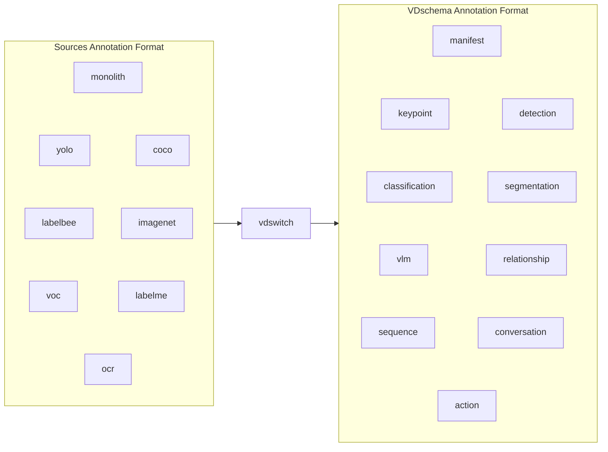

# VDschema

**VDschema**: A unified annotation **schema** for **V**ision **D**atasets with JSONL I/O support.

It supports two primary workflows:

- **Write** — annotation pipelines produce unified JSONL annotation data
- **Read** — training pipelines load JSONL into typed Python annotation objects

## VDswitch

vdswitch is a converter: convert the common vision dataset annotation format to vdschema annotation format.  




## Install

**PyPI (pip)**

```bash
pip install vdschema

# Dataset conversion CLI (opencv, pillow)
pip install "vdschema[vdswitch]"
```

**PyPI (uv)**

```bash
uv pip install vdschema
uv add vdschema
```

**From source (git)**

```bash
git clone https://github.com/Arrkwen/vdschema.git
cd vdschema
uv sync --extra vdswitch --group dev
pip install -e ".[vdswitch]"
```

## Quick start

### vdschema

```python
from vdschema import AnnotationReader, AnnotationWriter, Name, TaskType

writer = AnnotationWriter(
    TaskType.DETECTION,
    label={1: Name("person"), 2: Name("car")},
)
writer.append(
    filename="images/sample.jpg",
    width=640,
    height=480,
    instances=[{"id": 0, "category_id": 1, "bbox": [10, 20, 100, 200]}],
)
writer.save()

data, label = AnnotationReader(TaskType.DETECTION, writer.save_dir()).load()
print(label[1].name)  # person
```

More tasks and options: [docs/vdschema.md](docs/vdschema.md). Public types and parameters: [docs/api.md](docs/api.md).

### vdswitch

```bash
vdswitch --task detection --source coco \
  --input-data /path/to/instances_train2017.json \
  --output output

vdswitch help --task detection --source coco
```

More tasks and options: [docs/vdswitch.md](docs/vdswitch.md).

## Development

```bash
git clone https://github.com/Arrkwen/vdschema.git
cd vdschema
uv sync --extra vdswitch --group dev
uv run pytest
uv run ruff check .
uv run ruff format --check .
uv run ty check
uv build
```

## Publishing

1. Bump `version` in `pyproject.toml` (used at runtime via package metadata and by `uv build`).
2. Create a **Published** GitHub Release with a new tag (e.g. `0.1.0`).

The [publish.yml](.github/workflows/publish.yml) workflow runs on release publish and uploads the build to PyPI. You can also re-run it manually from Actions → **vdschema-publisher**.

## Acknowledgments

**vdschema** defines its own JSONL schema. **vdswitch** only reads common *file layouts*; it does not ship or grant rights to third-party datasets. If you convert or train on external data, follow that dataset’s terms.

| Format / tool | Reference |
| ------------- | --------- |
| [MS COCO](https://cocodataset.org/) | [Terms of use](https://cocodataset.org/#termsofuse) (annotations under [CC BY 4.0](https://creativecommons.org/licenses/by/4.0/)) |
| [PASCAL VOC](http://host.robots.ox.ac.uk/pascal/VOC/) | [FAQ / conditions](http://host.robots.ox.ac.uk/pascal/VOC/voc2012/htm/documents.html) |
| [LabelMe](https://github.com/wkentaro/labelme) | JSON export format ([MIT](https://github.com/wkentaro/labelme/blob/main/LICENSE)) |
| [LabelBee](https://github.com/open-mmlab/labelbee-client) | [General Data annotation spec](https://github.com/open-mmlab/labelbee-client/tree/main/docs/annotation) |
| [ImageNet](https://www.image-net.org/) | [Download / terms](https://www.image-net.org/download.php) |
| YOLO-style labels | De-facto layout (`images` + `labels` + `classes.txt`); see your dataset or [Ultralytics docs](https://docs.ultralytics.com/datasets/detect/) |

Thanks to the authors and maintainers of these formats and tools.

## License

**vdschema** (this repository’s source code, schema definitions, and vdswitch) is released under the **[MIT License](LICENSE)**.

Implementing a reader for an external layout does not change that layout’s license. **You** are responsible for complying with licenses and usage rules when downloading, converting, or redistributing dataset files.